# 🐍 Python Practice Questions — Your ML Journey
### Designed for: 1 month Python learner → Future ML Engineer
### Difficulty: Medium to Hard | Language: English + Hinglish

---

> **Kaise use karo yeh document?**
> Har question ko dhyan se padho. Pehle khud solve karne ki koshish karo — kam se kam 30-45 minute. Hints aur answers mat dekho pehle. Discomfort hi growth hai. 💪

---

## 📋 Table of Contents

| # | Question | Topic | Level | ML Relevant |
|---|----------|-------|-------|-------------|
| Q1 | Normalize a dataset | NumPy + Math Logic | Medium | ✅ Yes |
| Q2 | Find all pairs summing to target | Lists + Sets | Medium | ✅ Yes |
| Q3 | DataPoint class with stats | OOP + Statistics | Medium | ✅ Yes |
| Q4 | Parse a CSV manually | File Handling + Dicts | Medium | ✅ Yes |
| Q5 | Flatten a nested list | Recursion + Lists | Medium-Hard | ✅ Yes |
| Q6 | Matrix multiplication | NumPy + Linear Algebra | Medium-Hard | ✅ Yes |
| Q7 | Group records by a key | Dicts + Comprehension | Medium | ✅ Yes |
| Q8 | Build a Pipeline class | OOP + Functions | Hard | ✅ Yes |
| Q9 | Key-value store with file | File Handling + OOP | Hard | ⬜ Core |
| Q10 | Detect and handle outliers | NumPy + Statistics | Hard | ✅ Yes |

---

## Q1 — Normalize a Dataset (Manually + NumPy)

**Topic:** NumPy + Math Logic | **Level:** 🟡 Medium | **ML Relevant:** ✅

---

### 📌 English Explanation

Normalization is the process of scaling numbers so they all fall between **0 and 1**. Imagine you have student marks: some are 10, some are 500 — they are on very different scales. Before feeding this data to an ML model, we need every number to be on the same scale. This is called **min-max normalization**.

The formula is:

```
normalized_value = (x - minimum) / (maximum - minimum)
```

In this question, you will solve this **twice** — once using only raw Python (no libraries), and once using NumPy. Then you will compare both outputs.

---

### 🗣️ Hinglish Mein Samjho

Socho ek class mein 5 students ke marks hain: `[10, 20, 30, 40, 50]`

Ab yeh marks 10 se 50 ke beech hain. Machine learning model ko chahiye ki saare numbers **0 aur 1 ke beech** ho — kyunki model ko bada aur chhota ka pata nahi, use sirf consistent scale chahiye.

**Min-Max formula** yeh karta hai:
- Sabse chhota number → 0 ban jaata hai
- Sabse bada number → 1 ban jaata hai
- Baaki sab beech mein aate hain

Toh `10` → `0.0`, `30` → `0.5`, `50` → `1.0`

Is question mein **do baar** solve karna hai:
1. Sirf pure Python se (loops, basic math)
2. NumPy use karke (ek hi line mein)

Dono ke answers same aane chahiye — tab samjhoge ki NumPy kya shortcut deta hai.

---

### ✏️ Your Task

```
Given:
data = [10, 20, 30, 40, 50]

Part 1 — Pure Python:
• Write a function normalize_python(data) using only loops and basic math
• Apply the min-max formula manually
• Return the normalized list

Part 2 — NumPy:
• Write a function normalize_numpy(data) using NumPy array operations
• No loops allowed in this part — use vectorized NumPy operations only

Part 3 — Compare:
• Print both outputs side by side
• They must match exactly
• Also print: which approach used fewer lines of code?
```

---

### 🧠 What Concept is Being Tested?

- Writing mathematical formulas in code
- Understanding why we need the same scale in ML
- Seeing the difference between loop-based code and NumPy vectorized code
- Building a mental bridge between "Python math" and "NumPy math"

---

### 🔗 Visual: How Min-Max Normalization Works

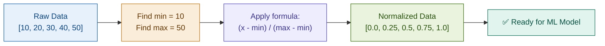

---

### 🔗 Visual: Pure Python vs NumPy Approach

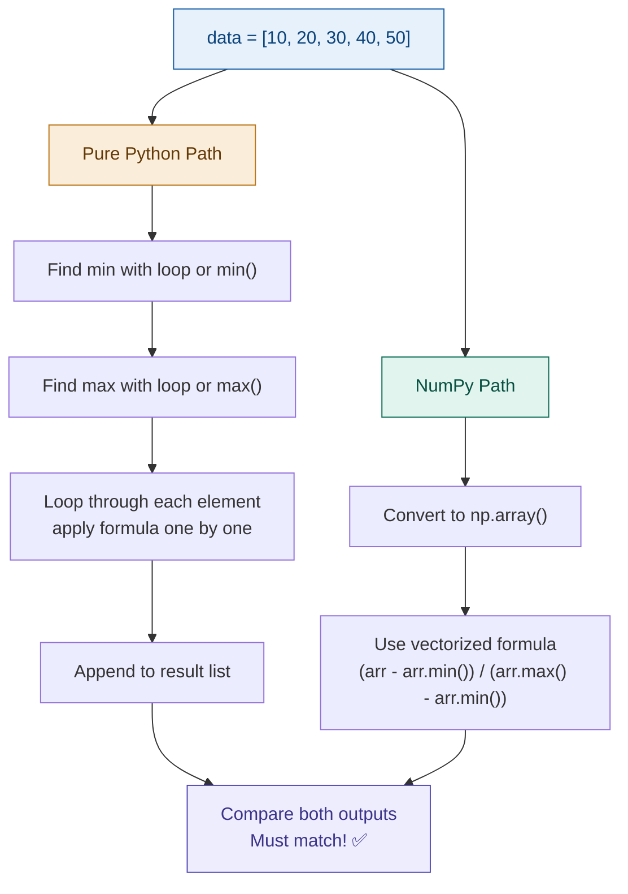

---

---

## Q2 — Find All Pairs That Sum to a Target

**Topic:** Lists + Sets | **Level:** 🟡 Medium | **ML Relevant:** ✅

---

### 📌 English Explanation

You are given a list of numbers and a target sum. Your goal is to find **all unique pairs** from the list that add up to the target. The catch — you must NOT use the simple brute-force approach of checking every pair with two nested loops (that is O(n²) and very slow on large datasets). You must find an efficient solution using a **Set**.

This is one of the most commonly asked questions in data engineering and ML interviews.

---

### 🗣️ Hinglish Mein Samjho

Ek list hai: `[1, 5, 3, 7, 9, 2, 8]`
Target hai: `10`

Matlab: kaunse do numbers ko jodne se `10` milta hai?
- `1 + 9 = 10` ✅
- `3 + 7 = 10` ✅
- `2 + 8 = 10` ✅

Ab **galat tarika** yeh hoga: har number ko har doosre number se add karo — do nested loops. Yeh bahut slow hai.

**Sahi tarika:** Ek `set` rakho "dekhe hue numbers" ka. Har number `x` ke liye check karo ki kya `(target - x)` pehle se set mein hai. Agar hai — toh pair mil gaya!

Ek aur rule: `(3, 7)` aur `(7, 3)` ek hi pair hain. Duplicate pairs nahi chahiye.

---

### ✏️ Your Task

```
Given:
numbers = [1, 5, 3, 7, 9, 2, 8]
target = 10

Requirements:
• Find all unique pairs (a, b) where a + b == target
• Each pair should appear only once — (3,7) and (7,3) are the same pair
• You CANNOT use a brute-force double-loop (O(n²) solution)
• Use a Set-based approach for O(n) efficiency
• Print all pairs in a clean format

Expected Output (order may vary):
Pairs that sum to 10: [(1, 9), (3, 7), (2, 8)]
```

---

### 🧠 What Concept is Being Tested?

- Understanding of time complexity (O(n) vs O(n²))
- Creative use of Sets for fast lookup
- Handling duplicates elegantly
- Building the mindset of "efficient thinking" — critical for ML data pipelines

---

### 🔗 Visual: Set-Based Approach Flowchart

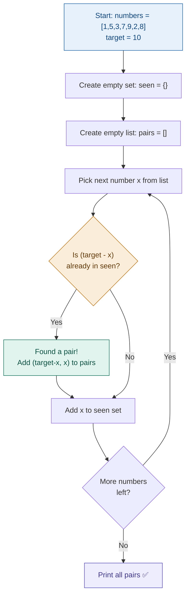

---

---

## Q3 — Build a DataPoint Class with Statistics Methods

**Topic:** OOP + Statistics | **Level:** 🟡 Medium | **ML Relevant:** ✅

---

### 📌 English Explanation

In machine learning, data is everything. Before you use libraries like NumPy or Pandas to calculate statistics, you must understand how those statistics are calculated internally. In this question, you will build a Python class called `DataPoint` that holds a list of numbers and can calculate **mean**, **median**, and **standard deviation** — all from scratch.

This is pure OOP design applied to a data science problem.

---

### 🗣️ Hinglish Mein Samjho

Socho tumhare paas 5 students ke marks hain: `[70, 80, 90, 60, 85]`

Tumhe ek aise Python object banana hai jo:
- Yeh data store kare
- Automatically **average (mean)** nikale
- **Median** (beech wala number) nikale  
- **Standard Deviation** nikale — matlab kitna variation hai data mein

Aur yeh sab bina kisi library ke — sirf pure Python logic se.

**Standard Deviation kya hoti hai?** Agar saare marks almost same hain → SD kam hogi. Agar marks bahut different hain → SD zyada hogi. ML mein yeh batata hai ki data kitna "spread out" hai.

**OOP angle:** Ek class banao, usme `__init__`, methods, aur `__repr__` implement karo. Yeh pattern real ML codebase mein har jagah milega.

---

### ✏️ Your Task

```
Create a class DataPoint:

__init__(self, data):
  • Accepts a list of numbers
  • Raises ValueError if the list is empty (with a meaningful message)

Methods to implement (NO statistics/numpy module allowed):
  • mean() → return the average
  • median() → return the middle value (sort the list, pick the center)
  • std_dev() → return the standard deviation (see formula below)

__repr__:
  • Must print: DataPoint(n=5, mean=77.0)

Standard Deviation Formula:
  1. Find the mean
  2. Subtract mean from each value, square the result
  3. Find the average of those squared differences
  4. Take the square root of that average

Test it with:
  dp = DataPoint([70, 80, 90, 60, 85])
  print(dp)           # DataPoint(n=5, mean=77.0)
  print(dp.mean())    # 77.0
  print(dp.median())  # 80
  print(dp.std_dev()) # should print a float
```

---

### 🧠 What Concept is Being Tested?

- OOP design: `__init__`, methods, `__repr__`
- ValueError and exception handling inside a class
- Manual implementation of statistical formulas
- Understanding why standard deviation matters in ML (feature scaling, outlier detection)

---

### 🔗 Visual: Standard Deviation — Step by Step

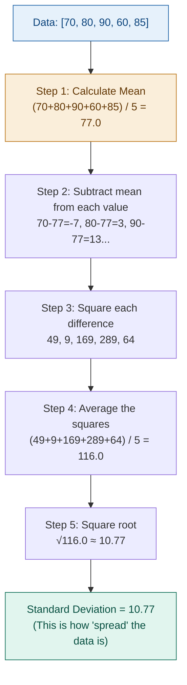

---

---

## Q4 — Parse a CSV Manually and Compute Column Statistics

**Topic:** File Handling + Dictionaries | **Level:** 🟡 Medium | **ML Relevant:** ✅

---

### 📌 English Explanation

Every ML project starts with loading data. Usually engineers use `pandas.read_csv()` — but do you know what it actually does inside? In this question, you will build that logic yourself. You'll create a CSV file, read it manually line by line, split it into structured data, and then compute statistics on specific columns.

This is the foundation that makes Pandas feel like magic once you understand it.

---

### 🗣️ Hinglish Mein Samjho

Ek CSV file hoti hai aise:

```
name,age,score
Rahul,20,85
Amit,22,78
Priya,21,92
Sara,,88
```

`Sara` ki age missing hai — yeh real-world data mein bahut common hai.

Tumhe:
1. Yeh file **manually** read karni hai — sirf `open()` use karo, koi `csv` module nahi, koi Pandas nahi
2. Har line ko split karo `,` se
3. Data ko list of dictionaries mein store karo
4. Statistics nikalo: average age, highest score, topper ka naam
5. Missing values wali rows ko gracefully skip karo (crash mat karo)

Jab tum yeh kar loge, tab `pd.read_csv()` chalao aur dekho — woh ek line mein wahi karta hai jo tumne 30 lines mein kiya. Tab appreciation aayegi! 😄

---

### ✏️ Your Task

```
Step 1 — Create the file:
  Create a file called student_data.csv with at least 6 rows:
  Columns: name, age, score
  Include at least 2 rows with a missing value (empty field)

Step 2 — Read and parse manually:
  • Open the file with open()
  • Skip the header row
  • Split each line by comma
  • Store each valid row as a dict: {'name': ..., 'age': ..., 'score': ...}
  • Skip any row that has a missing or invalid value (use try-except)

Step 3 — Compute:
  • Average age (rounded to 1 decimal)
  • Highest score
  • Name of the student with the highest score

Step 4 — Bonus:
  • After solving manually, do the same thing using Pandas in 3-4 lines
  • Print: "Manual approach: X lines of code | Pandas approach: Y lines"
```

---

### 🔗 Visual: CSV Parsing Flow

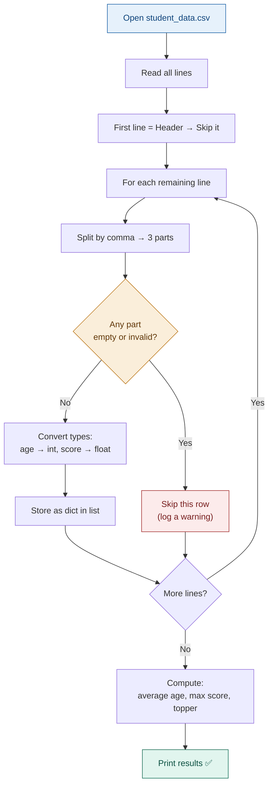

---

---

## Q5 — Flatten a Nested List of Any Depth

**Topic:** Recursion + Lists | **Level:** 🟠 Medium-Hard | **ML Relevant:** ✅

---

### 📌 English Explanation

Real-world data is messy. You often receive lists nested inside lists, sometimes 3 or 4 levels deep. Before you can process the data, you need to flatten it into a single clean list. This requires **recursion** — a function that calls itself.

This is used constantly in ML data preprocessing pipelines.

---

### 🗣️ Hinglish Mein Samjho

Maan lo tumhare paas yeh data hai:

```python
[1, [2, [3, [4]], 5], 6]
```

Yeh ek "nested list" hai — list ke andar list, uske andar aur list. Tumhe isse "flat" banana hai:

```python
[1, 2, 3, 4, 5, 6]
```

**Recursion kaise kaam karta hai:** Har element ko check karo — agar woh ek list hai, toh uske andar ghus jao (function khud ko call karta hai). Agar list nahi hai, toh result mein add karo.

Socho ek Russian doll (Matryoshka) ki tarah — doll ke andar doll, andar aur doll. Tumhare function ko saari dolls kholni hain aur andar jo cheez hai use collect karna hai.

Koi external library nahi, koi shortcut nahi — sirf pure recursive logic.

---

### ✏️ Your Task

```
Write a function: flatten(lst)

Requirements:
• Input can be nested to ANY depth:
  [1, [2, [3, [4, [5]]]]] → [1, 2, 3, 4, 5]
  
• Must handle mixed types:
  [1, 'hello', [2, ['world', 3]]] → [1, 'hello', 2, 'world', 3]
  
• Must handle empty nested lists:
  [1, [], [2, [[], 3]]] → [1, 2, 3]
  
• NO external libraries — pure Python recursion only

• Must work for at least 5 different test inputs that you create yourself

Key function to use: isinstance(element, list)
  → Use this to check if an element is a list or not
```

---

### 🧠 What Concept is Being Tested?

- Recursion logic — a function calling itself
- `isinstance()` for type checking
- Base case vs recursive case thinking
- Understanding that ML data pipelines often receive multi-level structured data

---

### 🔗 Visual: How Recursion Unravels a Nested List

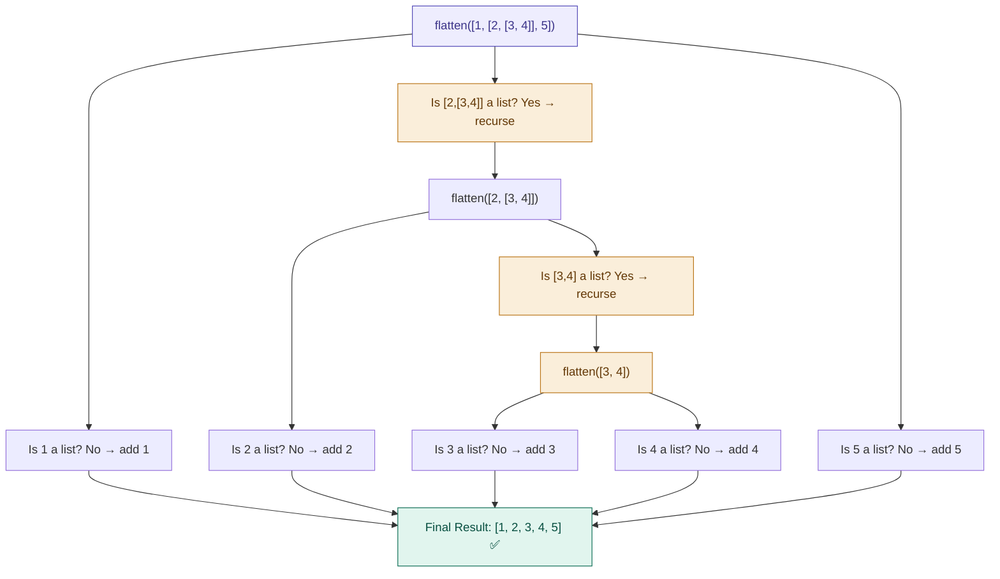

---

---

## Q6 — Matrix Multiplication (Manually + NumPy)

**Topic:** NumPy + Linear Algebra | **Level:** 🟠 Medium-Hard | **ML Relevant:** ✅

---

### 📌 English Explanation

**Every single ML model runs on matrix math.** Neural networks, linear regression, transformers — all are fundamentally matrix operations. If you understand matrix multiplication, NumPy will make perfect sense. If you don't, you'll always feel lost.

In this question, you will first implement matrix multiplication by hand using nested lists, and then do it in one line with NumPy. The goal is to understand what NumPy is actually computing.

---

### 🗣️ Hinglish Mein Samjho

**Matrix multiplication kya hota hai?**

Do matrices hain:
```
A = [[1, 2],     B = [[5, 6],
     [3, 4]]          [7, 8]]
```

Result matrix `C = A × B` nikalna hai. Rule yeh hai:
- `C[0][0]` = Row 0 of A × Column 0 of B = `(1×5) + (2×7)` = `19`
- `C[0][1]` = Row 0 of A × Column 1 of B = `(1×6) + (2×8)` = `22`
- `C[1][0]` = Row 1 of A × Column 0 of B = `(3×5) + (4×7)` = `43`
- `C[1][1]` = Row 1 of A × Column 1 of B = `(3×6) + (4×8)` = `50`

Yeh formula tumhe manually code karna hai. Phir `np.dot(A, B)` se check karo — same answer aayega.

**NumPy kyun important hai:** Jab ek neural network train hota hai, millions of matrix multiplications hoti hain. NumPy yeh C/Fortran mein karta hai — isliye 100x faster hai pure Python se.

---

### ✏️ Your Task

```
Given:
A = [[1, 2], [3, 4]]
B = [[5, 6], [7, 8]]

Part 1 — Pure Python:
  • Write a function matrix_multiply(A, B) using only loops
  • No NumPy, no external library
  • Must work for any two compatible 2D matrices (not just 2x2)
  • Return the result as a nested list

Part 2 — NumPy:
  • Convert A and B to NumPy arrays
  • Use np.dot() or the @ operator to multiply
  • Return the result

Part 3 — Compare:
  • Print both results
  • They must be identical

Bonus:
  • Write a function transpose(matrix) using list comprehension
  • Transpose means rows become columns
  • [[1,2],[3,4]] → [[1,3],[2,4]]
```

---

### 🔗 Visual: Matrix Multiplication Step-by-Step

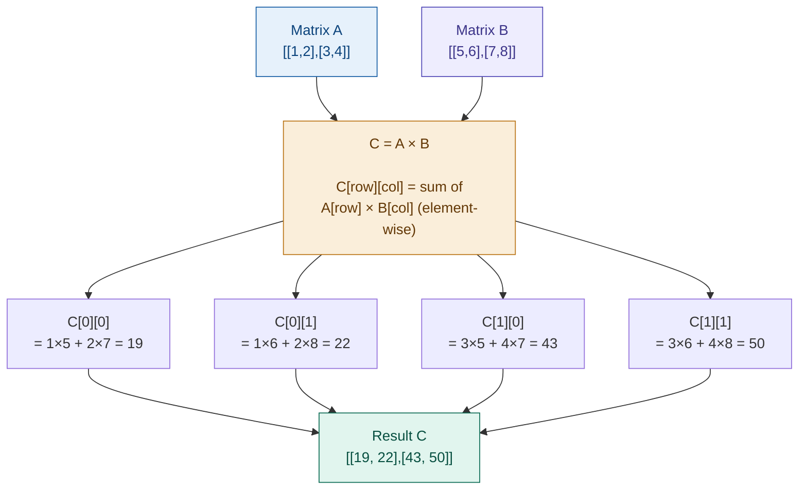

---

---

## Q7 — Group a List of Records by a Key

**Topic:** Dictionaries + Comprehension | **Level:** 🟡 Medium | **ML Relevant:** ✅

---

### 📌 English Explanation

Grouping is one of the most fundamental data operations. In Pandas it's called `groupby()`. In SQL it's `GROUP BY`. In this question you will implement this logic yourself using only Python dictionaries — two ways: with a regular loop, and with a dictionary comprehension.

---

### 🗣️ Hinglish Mein Samjho

Tumhare paas students ka data hai:

```python
[
  {'name': 'Rahul', 'city': 'Delhi'},
  {'name': 'Amit',  'city': 'Mumbai'},
  {'name': 'Priya', 'city': 'Delhi'},
  {'name': 'Sara',  'city': 'Mumbai'},
  {'name': 'Karan', 'city': 'Pune'}
]
```

Tumhe isse **city ke hisaab se group** karna hai:

```python
{
  'Delhi':  ['Rahul', 'Priya'],
  'Mumbai': ['Amit', 'Sara'],
  'Pune':   ['Karan']
}
```

Pandas mein yeh ek line mein hota hai: `df.groupby('city')['name'].apply(list)`

Lekin tum pehle yeh manually banao — tab Pandas ki value samajh mein aayegi.

Yeh question `pd.groupby()` ka foundation hai — ML mein feature engineering ke time yeh pattern bahut aata hai.

---

### ✏️ Your Task

```
Given:
students = [
  {'name': 'Rahul', 'city': 'Delhi'},
  {'name': 'Amit',  'city': 'Mumbai'},
  {'name': 'Priya', 'city': 'Delhi'},
  {'name': 'Sara',  'city': 'Mumbai'},
  {'name': 'Karan', 'city': 'Pune'}
]

Approach 1 — Regular loop:
  • Use a for loop + dict.setdefault() to group names by city
  • Print the grouped dictionary

Approach 2 — Dictionary comprehension / one-liner:
  • Try to achieve the same result more concisely
  • Hint: this is harder to do in pure comprehension — think about it

Approach 3 — Extend it:
  • Now also count how many students are in each city
  • Output: {'Delhi': 2, 'Mumbai': 2, 'Pune': 1}

Bonus:
  • After all 3 approaches, do the same thing using Pandas groupby()
  • How many lines did each approach take?
```

---

---

## Q8 — Build a Pipeline Class That Chains Functions

**Topic:** OOP + Functions | **Level:** 🔴 Hard | **ML Relevant:** ✅

---

### 📌 English Explanation

In `scikit-learn` (the most popular ML library), there is a class called `Pipeline`. It lets you chain multiple data-processing steps together. For example: clean the text → lowercase it → remove punctuation → vectorize it. Each step's output becomes the next step's input.

In this question, you will build that exact concept from scratch. This question will give you a direct mental model of how `sklearn.Pipeline` works.

---

### 🗣️ Hinglish Mein Samjho

Socho tum ek text cleaning pipeline bana rahe ho:

```
Input: "  Hello, WORLD!  "

Step 1: strip() → "Hello, WORLD!"
Step 2: lower() → "hello, world!"
Step 3: remove punctuation → "hello world"

Output: "hello world"
```

Har step ka output agla step ka input ban jaata hai. Yahi concept `sklearn.Pipeline` mein hota hai — sirf wahan steps mein ML transformers hote hain.

Tumhe ek `Pipeline` class banani hai jo:
- Functions ki list accept kare
- `run(data)` method se data ko ek-ek step se pass kare
- Automatically output → input chain kare

Yeh question tumhara **OOP thinking + functional programming** dono ek saath test karega.

---

### ✏️ Your Task

```
Create a class Pipeline:

  __init__(self, steps):
    • steps = list of functions to apply in order

  run(self, data):
    • Pass data through each function in sequence
    • Output of step N becomes input of step N+1
    • Return the final output

Write 3 text-cleaning functions yourself:
  1. remove_extra_spaces(text) → strips leading/trailing whitespace
  2. to_lowercase(text) → converts to lowercase
  3. remove_punctuation(text) → removes .,!?;: and similar characters

Test it:
  pipe = Pipeline([remove_extra_spaces, to_lowercase, remove_punctuation])
  result = pipe.run("  Hello, WORLD! How are you?  ")
  print(result)  # "hello world how are you"

Bonus — Add error handling:
  • What if a step raises an exception?
  • Add a try-except inside run() that tells the user WHICH step failed
```

---

### 🔗 Visual: Pipeline Data Flow

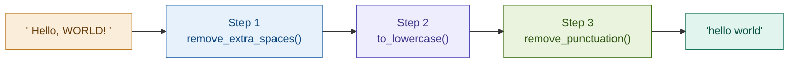

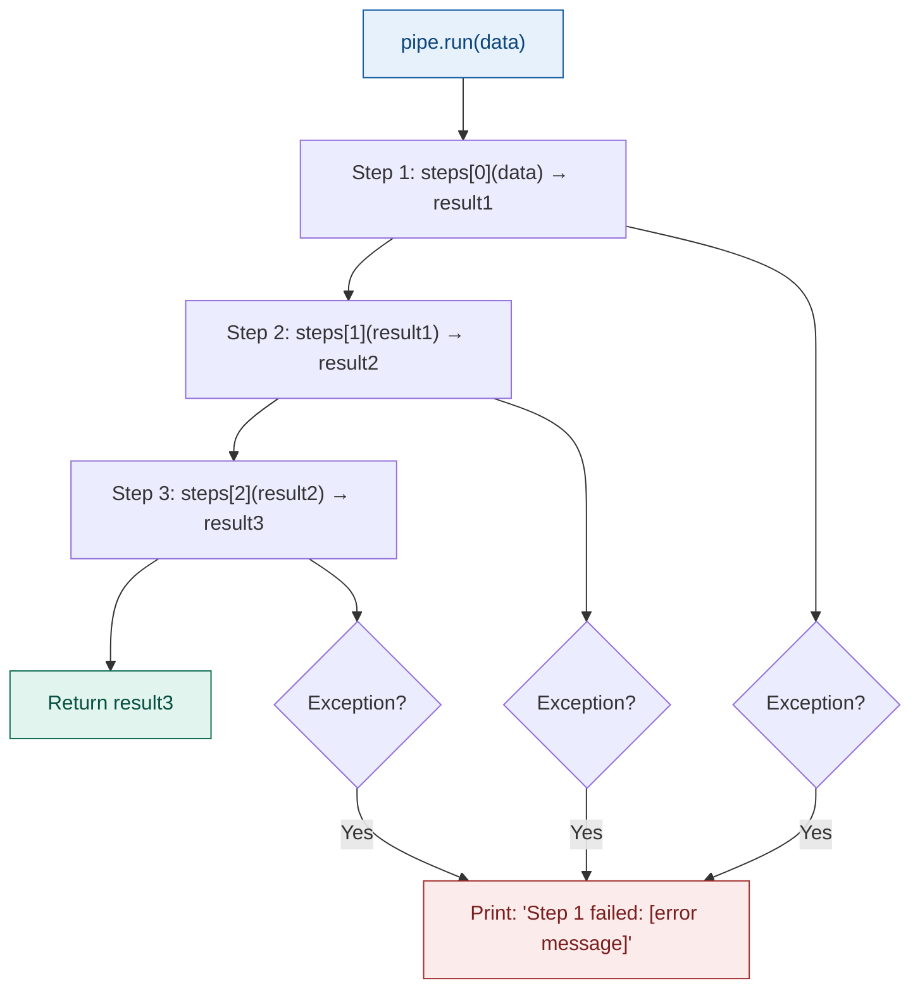

---

---

## Q9 — Build a Key-Value Store Backed by a File

**Topic:** File Handling + OOP + JSON | **Level:** 🔴 Hard | **Core Python**

---

### 📌 English Explanation

Every application needs to persist data. ML models save their configuration, feature stores save processed features, and databases save everything to disk. In this question, you will build a simple **persistent key-value store** — basically a mini-database that saves data to a JSON file and survives even after the program ends.

---

### 🗣️ Hinglish Mein Samjho

**Problem:** Python mein jo bhi variable hota hai, program band hone ke baad woh khatam ho jaata hai.

**Solution:** Data ko ek file mein save karo. Agali baar program chalao — file se data wapas load karo.

Tumhe ek class `FileStore` banani hai jo exactly yeh kare:

```python
store = FileStore("mydata.json")

store.set("username", "Rahul")     # file mein save ho
store.set("score", 95)

print(store.get("username"))       # "Rahul" — file se padha

store.delete("score")              # file se hataya

print(store.all())                 # {'username': 'Rahul'}
```

Program dobara chalao — data abhi bhi rahega! Yahi persistence hai.

**JSON kya hai:** Ek text format jo Python dictionaries ko file mein store karne ke liye use hota hai. `json.dump()` dictionary → file. `json.load()` file → dictionary.

---

### ✏️ Your Task

```
Create a class FileStore:

  __init__(self, filename):
    • Store the filename
    • If the file doesn't exist, start with an empty store

  set(self, key, value):
    • Add/update the key-value pair
    • Save to the JSON file immediately

  get(self, key):
    • Read from file, return value for that key
    • If key doesn't exist, return None (don't crash)

  delete(self, key):
    • Remove the key from the store
    • Save the updated store to file
    • If key doesn't exist, do nothing

  all(self):
    • Return the entire store as a dictionary

Error handling requirements:
  • Handle FileNotFoundError gracefully
  • Handle json.JSONDecodeError (corrupted file)
  • Handle missing key lookups without crashing

Test: Create the store, add 3 items, stop the program,
      start again, load the store — data must still be there.
```

---

### 🔗 Visual: FileStore Operations Flow

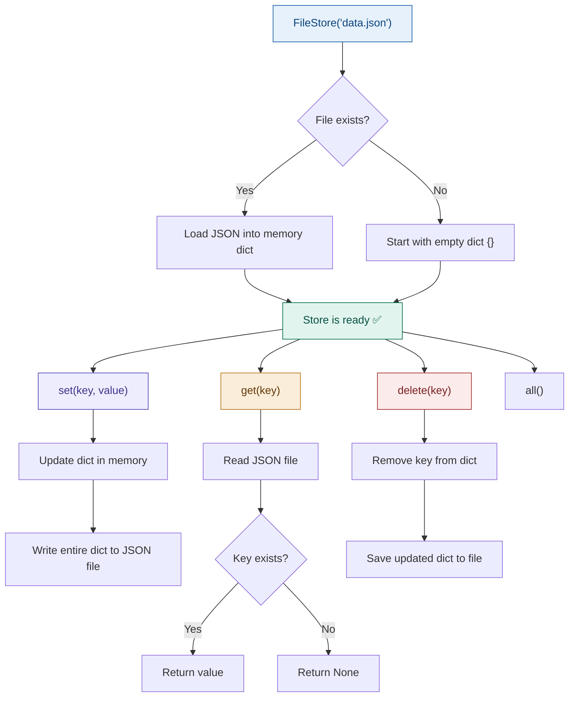

---

---

## Q10 — Detect and Handle Outliers in a Dataset

**Topic:** NumPy + Statistics + Logic | **Level:** 🔴 Hard | **ML Relevant:** ✅

---

### 📌 English Explanation

Outliers are data points that are extremely different from the rest of the data. For example, if most students score between 60-90, and one score is 300 — that 300 is an outlier. In ML, outliers can completely destroy your model's performance. Removing them is a critical preprocessing step.

The most common technique is the **Z-score method**: if a value is more than 2 standard deviations from the mean, it is an outlier.

---

### 🗣️ Hinglish Mein Samjho

Data hai: `[10, 12, 11, 300, 13, 9, 400, 11, 10]`

Clearly `300` aur `400` bahut alag hain. Yeh **outliers** hain.

**Z-score method:**
- Pehle mean aur standard deviation nikalo
- Har value ke liye check karo: kya yeh mean se 2 SD se zyada door hai?
- Agar haan → outlier hai

Formula:
```
z_score = (value - mean) / standard_deviation

If |z_score| > 2 → OUTLIER
```

**ML mein kyun important hai:** Agar outlier data mein rahega, toh model use "important" samjhega aur galat patterns seekhega. Har ML project mein outlier detection zaruri hai — yeh step 2-3 mein aata hai (normalization ke baad).

Is question mein pehle sirf pure Python se karo, phir NumPy se karo. Code kitna chhota ho jaata hai — woh dekho.

---

### ✏️ Your Task

```
Given:
data = [10, 12, 11, 300, 13, 9, 400, 11, 10]

Part 1 — Pure Python (no libraries):
  • Calculate mean manually
  • Calculate standard deviation manually (from Q3 formula)
  • For each value, calculate its z-score
  • Mark as outlier if |z_score| > 2
  • Print: list of outliers
  • Print: cleaned list (outliers removed)

Part 2 — NumPy:
  • Do the exact same thing using np.mean(), np.std()
  • Calculate z-scores using NumPy array operations (no loops)
  • Filter the array to remove outliers

Part 3 — Report:
  • Print both cleaned lists — they must match
  • Print: "Pure Python: X lines | NumPy: Y lines"
  • Print: what % of data was removed as outliers?
```

---

### 🔗 Visual: Z-Score Outlier Detection

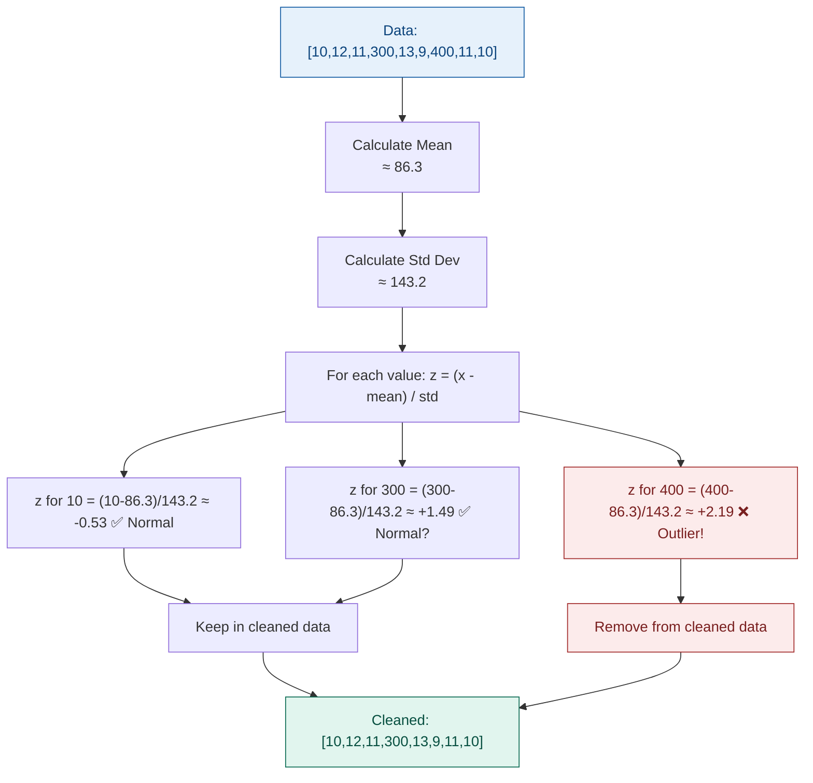

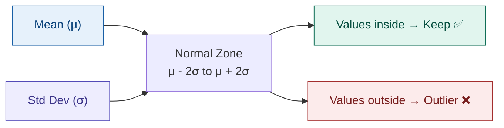

---

---

## 🗺️ Your Learning Roadmap

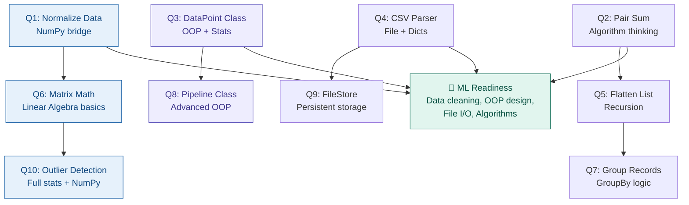

---

## 💡 Final Advice (ML Engineer ke liye)

> **"Yeh questions sirf Python practice nahi hain — yeh ML ki foundation hain."**

| Question | ML Skill it builds |
|----------|--------------------|
| Q1, Q6 | NumPy vectorization — how models process data |
| Q3, Q8 | OOP design — how sklearn classes are structured |
| Q4, Q9 | Data persistence — how datasets are stored/loaded |
| Q2, Q5 | Algorithmic thinking — preprocessing logic |
| Q7 | GroupBy / aggregation — Pandas foundation |
| Q10 | Data cleaning — every ML project needs this |

**Order to attempt:** Q2 → Q5 → Q1 → Q3 → Q7 → Q4 → Q6 → Q9 → Q8 → Q10

---

*Made for a 1-month Python learner on the road to becoming an ML Engineer* 🚀
